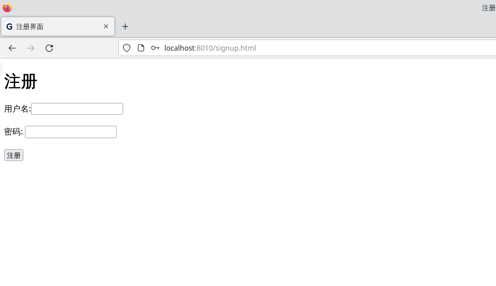

# SimpleWebServer

## 简介
&nbsp;&nbsp;&nbsp;&nbsp;一个用c++实现的简单WebServer, 运用IO复用机制和事件循环(epoll的LT和ET模式, 以及Reactor/Proactor模式)处理非阻塞IO, 实现高性能.  
&nbsp;&nbsp;&nbsp;&nbsp;用状态机解析HTTP请求, 能响应GET和POST方法并支持登录注册功能, 使用cookie来验证登录信息.  
&nbsp;&nbsp;&nbsp;&nbsp;使用LRU缓存, 线程池, 异步日志, 自旋锁和无锁队列等机制来提高性能.  
&nbsp;&nbsp;&nbsp;&nbsp;最终在本机(4核ryzen 3550H, linux 6.4.11-arch2-1)使用apache ab测试, 各种模式均可达到近万qps.

## 使用方法
编译: `g++ -lmysqlclient -o server main.cpp`  
运行: `sudo ./server -p 8010 -A 0`  
调试工具: `curl -i -X GET localhost:8010/ HTTP/1.1`, `curl -i -X POST localhost:8010/login HTTP/1.1 -d 'usr=u&passwd=p'`, 浏览器F12.  
压力测试: `ab -n 10000 -c 100 http://127.0.0.1:8010/`

### 参数说明:
> -p \<port>  
> -t <thread_num>  
> -T <connfd_trig(0:L 1:E)>  
> -A <actor_model(0:REACTOR 1:PROACTOR)>  
> -a <async_log(bool)>  
> -v <log_lv(0-3)>

## 展示




## 测试结果(Proactor+ET模式):
```shell
$ ab -n 100000 -c 200 http://127.0.0.1:8012/

Server Software:        
Server Hostname:        127.0.0.1
Server Port:            8012

Document Path:          /
Document Length:        620 bytes

Concurrency Level:      200
Time taken for tests:   9.925 seconds
Complete requests:      100000
Failed requests:        0
Total transferred:      70000000 bytes
HTML transferred:       62000000 bytes
Requests per second:    10075.10 [#/sec] (mean)
Time per request:       19.851 [ms] (mean)
Time per request:       0.099 [ms] (mean, across all concurrent requests)
Transfer rate:          6887.28 [Kbytes/sec] received

Connection Times (ms)
min  mean[+/-sd] median   max
Connect:        0    8   1.0      8      19
Processing:     4   11   1.7     12      27
Waiting:        0    9   1.9      9      19
Total:         11   20   1.3     20      35

Percentage of the requests served within a certain time (ms)
50%     20
66%     20
75%     21
80%     21
90%     21
95%     22
98%     22
99%     23
100%    35 (longest request)
```